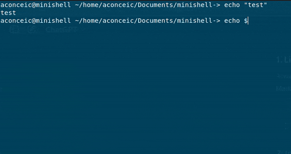

# 42_minishell
Repository of the project minishell from 42 Porto.

<!--  -->

## Table of contents

- [Sources and Acknowledgments](#sources-and-acknowledgments)
- [Introduction](#introduction)
- [Usage](#usage)
- [Example of usage](#example-of-usage)

## Sources and Acknowledgments
I would like to share the key resources that helped me to construct this project. My sincere thanks go out to everyone who has shared their knowledge freely with the community.

- [Minishell: Building a mini-bash](https://m4nnb3ll.medium.com/minishell-building-a-mini-bash-a-42-project-b55a10598218) - By [MannBell](https://m4nnb3ll.medium.com/)
- [Shell Program Explained - Playlist](https://www.youtube.com/watch?v=ubt-UjcQUYg) - By [hhp3](https://www.youtube.com/@hhp3)
- [What Happens When You Type a Command in Your Terminal](https://www.youtube.com/watch?v=2P7fcVHxA9o) - By [warpdotdev](https://www.youtube.com/@warpdotdev)
- [Chapter 5. Writing Your Own Shell](https://www.cs.purdue.edu/homes/grr/SystemsProgrammingBook/Book/Chapter5-WritingYourOwnShell.pdf) - By  Gustavo Rodriguez-Rivera and Justin Ennen,Introduction to Systems Programming: a Hands-on Approach (V2015-2-25)
(systemsprogrammingbook.com)
- [Unix terminals and shells](https://www.youtube.com/playlist?list=PLFAC320731F539902) - By [Brian Will](https://www.youtube.com/@briantwill)
- [Bash Reference Manual](https://www.gnu.org/software/bash/manual/bash.html) -  By Free Software Foundation, Inc
- [Write a shell in C](https://brennan.io/2015/01/16/write-a-shell-in-c/) - By [Stephen Brennan](https://brennan.io/)

And I would like to thank by peers from 42 Porto, who helped me a lot during all the process of this complex project. Thank you all. Sharing knowledge make us better.
Special thanks to [Isabella Miranda](https://github.com/bellamiranda), my partner throughout this project, who co-constructed this minishell with me.

---

## Introduction

This Project is about to recreate your own implementation of a shell based on bash shell.
[What is a shell](https://www.datacamp.com/blog/what-is-shell?dc_referrer=https%3A%2F%2Fwww.google.com%2F)

We needed to recreate some specifics behaviours of bash shell:
- Display a prompt when waiting for a new command;
- Have a working history.
- Search and launch the right executable (based on the PATH variable or using a
relative or an absolute path).
- Implement redirections:
- Implement pipes (| character) and Pipeline.
- Handle environment variables ($ followed by a sequence of characters) which
should expand to their values.
- Handle $? which should expand to the exit status of the most recently executed
foreground pipeline
- Handle ctrl-C, ctrl-D and ctrl-\ which should behave like in bash.
- Implements some builtins
For the complete list of requiremets and limitations, read the [subject](subject/en.subject.pdf).

---

## Usage
1 - In your terminal, clone the repository from github
```
	git clone git@github.com:amauricoder/42_minishell.git
```

2 - In your terminal, use 'make' to compile the project
```
	make
```

This will compile an executable program called minishell.
3 - Execute ./minishell without any argument
```
	./minishell
```

## Example of Usage
**Click on the image below to watch on Youtube an exaple of usage of this project**

[](https://www.youtube.com/watch?v=urz76d7-Gq4)
