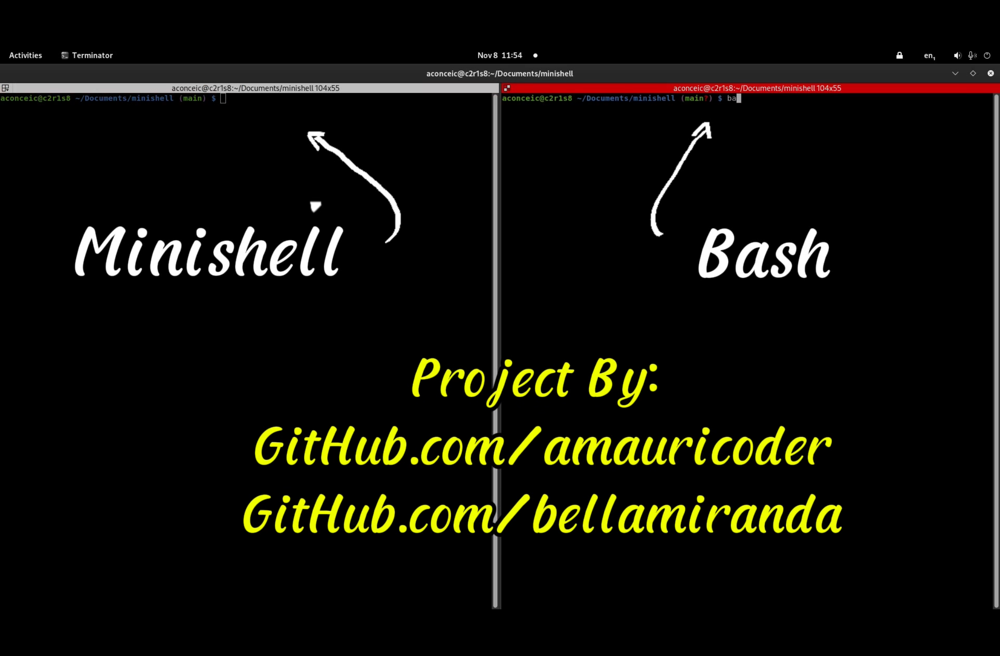

# Minishell
<!--  -->

## Table of contents

- [Sources and Acknowledgments](#sources-and-acknowledgments)
- [Introduction](#introduction)
- [Usage](#usage)
- [Example of usage](#example-of-usage)
- [Overview](#overview)
- [License](#license)

## Sources and Acknowledgments
I would like to share the key resources that helped me to construct this project. My sincere thanks go out to everyone who has shared their knowledge freely with the community.

- [Minishell: Building a mini-bash](https://m4nnb3ll.medium.com/minishell-building-a-mini-bash-a-42-project-b55a10598218) - By [MannBell](https://m4nnb3ll.medium.com/)
- [Shell Program Explained - Playlist](https://www.youtube.com/watch?v=ubt-UjcQUYg) - By [hhp3](https://www.youtube.com/@hhp3)
- [What Happens When You Type a Command in Your Terminal](https://www.youtube.com/watch?v=2P7fcVHxA9o) - By [warpdotdev](https://www.youtube.com/@warpdotdev)
- [Chapter 5. Writing Your Own Shell](https://www.cs.purdue.edu/homes/grr/SystemsProgrammingBook/Book/Chapter5-WritingYourOwnShell.pdf) - By  Gustavo Rodriguez-Rivera and Justin Ennen,Introduction to Systems Programming: a Hands-on Approach (V2015-2-25)
(systemsprogrammingbook.com)
- [Unix terminals and shells](https://www.youtube.com/playlist?list=PLFAC320731F539902) - By [Brian Will](https://www.youtube.com/@briantwill)
- [Bash Reference Manual](https://www.gnu.org/software/bash/manual/bash.html) -  By Free Software Foundation, Inc
- [Write a shell in C](https://brennan.io/2015/01/16/write-a-shell-in-c/) - By [Stephen Brennan](https://brennan.io/)

And I would like to thank by peers from 42 Porto, who helped me a lot during all the process of this complex project. Thank you all. Sharing knowledge make us better.
Special thanks to [Isabella Miranda](https://github.com/bellamiranda), my partner throughout this project, who co-constructed this minishell with me.

## Introduction

This Project is about to recreate your own implementation of a shell based on bash shell.
[What is a shell](https://www.datacamp.com/blog/what-is-shell?dc_referrer=https%3A%2F%2Fwww.google.com%2F)

We needed to recreate some specifics behaviours of bash shell:
- Display a prompt when waiting for a new command;
- Have a working history.
- Search and launch the right executable (based on the PATH variable or using a
relative or an absolute path).
- Implement redirections:
- Implement pipes (| character) and Pipeline.
- Handle environment variables ($ followed by a sequence of characters) which
should expand to their values.
- Handle $? which should expand to the exit status of the most recently executed
foreground pipeline
- Handle ctrl-C, ctrl-D and ctrl-\ which should behave like in bash.
- Implements some builtins
For the complete list of requiremets and limitations, read the [subject](subject/en.subject.pdf).
>The code was written according to the 42 norm guidelines(norminette). <br>
[View Norm](42_norm/en.norm.pdf)

## Usage
1 - In your terminal, clone the repository from github
```
	git clone git@github.com:amauricoder/42_minishell.git
```

2 - In your terminal, use 'make' to compile the project
```
	make
```

This will compile an executable program called minishell.
3 - Execute ./minishell without any argument
```
	./minishell
```

Optional - If you have valgrind installed, you can use the command above to detect leaks.
```
  valgrind --leak-check=full --track-fds=yes --show-leak-kinds=all --suppressions=.ignore_readline -q ./minishell
```
## Example of Usage
**Click on the image below to watch on Youtube an exaple of usage of this project**

[](https://youtu.be/9arIs9rZsGE)

---

## Overview

This project recreates a simplified version of Bash with some basic functionalities. The implementation uses a top-down parsing algorithm with a tree structure. The program is divided into several key parts:

1. **Syntax Analysis**
2. **Tokenization**
3. **Parsing**
4. **Execution**

## 1. Syntax Analysis

**Purpose:** Syntax analysis checks if the user's input follows the correct syntax rules before any further processing. It is done at the beginning to ensure that the input is valid and free from structural errors.

- **When it's performed:** Syntax analysis happens first, before tokenization and parsing, to quickly catch errors.
- **Why at the start?** By performing syntax analysis early, the program avoids unnecessary computations and memory allocations. If the syntax is invalid, there's no point in proceeding with tokenization, parsing, or execution.
- **How it works:** It scans the raw input to detect issues such as mismatched parentheses, missing operators, or unbalanced quotes.

## 2. Tokenization

**Purpose:** Tokenization breaks down the input string into meaningful chunks or "tokens" that can be processed individually. These tokens represent different parts of the command, such as commands, arguments, options, and operators.

- **What gets tokenized?**
  - **Commands:** e.g., `ls`, `echo`, `cat`
  - **Arguments:** e.g., `-l`, `/home/user`
  - **Operators:** e.g., `|`, `>`, `>>`, `<<`
  - **Separators:** e.g., spaces, semicolons

**Purpose:** Tokenization breaks down the input string into meaningful units, or "tokens," that the shell can process individually. These tokens represent different parts of the command, such as commands, arguments, options, and special characters.

- **How it works:** The tokenization process in this project is more sophisticated, using a state machine to handle different types of tokens based on the characters encountered in the input. Here's a breakdown of the main logic:
  
  - The function `do_lexing` iterates through the input string, character by character.
  - If a special character is encountered (e.g., quotes, redirection symbols), the function `do_lexing_aux` is called to process it.
  - If the character is not a special character, the program treats it as part of a word (e.g., command or argument). It continues scanning until another special character or delimiter is found.
  - The function `create_token` is used to create a token based on the current state, which is determined by the type of character being processed. Special handling is applied for quotes (`'`, `"`) and redirection operators (`>`, `<`, `>>`, `<<`).
  
- **Detailed Breakdown:**
  - **Handling Special Characters:** When a special character is detected (such as a single quote, double quote, or redirection operator), the program enters a specific state for processing that character. For instance:
    - If a single quote (`'`) is encountered, the function `in_quote` is called, which handles the tokenization of the text inside the quotes.
    - Redirection operators like `>` or `<` are processed using the `redir_env` function, which checks if additional characters (such as `>>` or `<<`) follow and creates the appropriate token.
  - **Handling Words:** If a character is not a special character, it is considered part of a word. The function scans through the input to capture the entire word until another special character or space is encountered.
  
- **Why it's important:** Tokenization is crucial because it breaks the input into discrete units that can be further analyzed and executed. Without this step, the shell would not be able to distinguish between commands, arguments, operators, or special symbols. By categorizing each part of the input, the shell can process complex commands that involve options, redirection, piping, and more.

### Key Functions:

- `do_lexing`: This function manages the main tokenization loop, identifying special characters and delegating processing to the appropriate functions.
- `do_lexing_aux`: Handles the tokenization of special characters (quotes, spaces, redirection).
- `in_quote`: Processes tokens inside single (`'`) or double (`"`) quotes.
- `redir_env`: Handles redirection operators (e.g., `>`, `<`, `>>`).
- `create_token`: Creates a token based on the current state and the identified substring.

- **Why it's important:** Tokenization allows the shell to interpret and process different parts of a command separately, making it possible to handle complex commands with multiple arguments and operators.

## 3. Parsing

**Purpose:** Parsing takes the tokens produced during tokenization and organizes them into a structured format, which can then be used for further execution. The parsing process builds a tree-like structure that represents the logical flow of the command, including handling commands, redirections, pipes, and other special operators.

- **How it works:** The parsing process in this project follows a series of steps, which includes handling commands, redirection, and pipes by organizing tokens into a tree-like structure of nodes.

The parsing process is a hierarchical flow where commands are processed first, followed by handling redirection and pipes. Here’s the general flow of parsing:

1. **Command Parsing (`parse_exec`)**: Each token is checked to see if it represents a command. If it does, an execution node is created to hold the command and its arguments.
2. **Redirection Parsing (`parse_redir`)**: After processing the command, redirection operators (like `>`, `<`, `>>`) are handled by creating redirection nodes and linking them to the execution node.
3. **Pipe Parsing (`parse_pipe`)**: If a pipe (`|`) is detected, the `parse_pipe` function creates a new pipe node that connects the left and right sides of the pipe operation.

**IMPORTANT**

Almost all the project and functions are documented along the code as comments.
For you to understand better what happen exactly, you need to understand the concept of Binary Tree.
Again, We construct our Binary Tree based on top down parsing algorithm. Click [HERE](https://www.youtube.com/watch?v=ubt-UjcQUYg) and watch this video 100x times(like us) to be able to understand an recreate a binary tree using this algorithm.

## 4. Execution

The execution phase takes the parsed structure and performs the actual action, running the command and executing.

- **What happens during execution?**
  - The program checks if the command exists (e.g., `ls`, `echo`).
  - It prepares the arguments and environment, managing operations like pipes, redirection, and background processes.
  - The shell runs the command by forking new processes using system calls like `fork()`, `exec()`, and `wait()`.
- **Why Execution is Important:** Execution is the final step where the actual work is done—running the command and producing output. Without execution, the shell would only parse and analyze the input but wouldn't carry out any action.

## HereDoc
To better recriate the functionality and behaviour of bash, we needed to execute the Heredocs separately.
This process is done after the parsing and before the execution.
Doing this way, are able to recreate the heredoc with some edge cases, like pressing ctrl + c during multiple heredocs and getting the correct exit code.

## License
[LICENSE](LICENSE)
